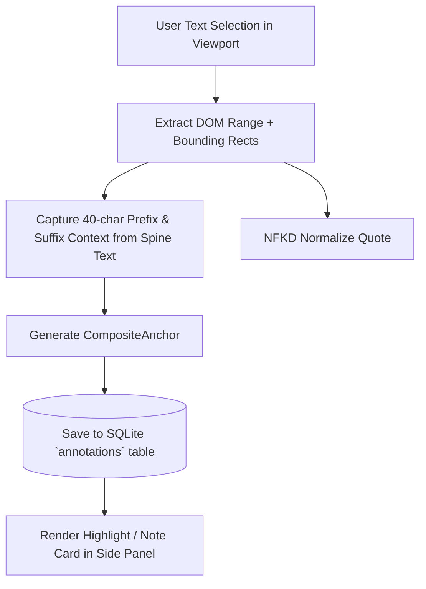

# Luma — Annotation Integration & Anchor Resolution

## 1. Selection-to-Anchor Flow

---

## 2. Re-Opening & Reflow Resolution Algorithm

When reopening or reflowing a chapter:
1. `luma-anchor::AnchorResolver` takes the stored `CompositeAnchor` and target chapter text.
2. Performs exact normalized matching with weighted context scoring.
3. If text reflow shifted whitespace or punctuation, sliding window fuzzy matching scores candidate positions.
4. **Safety Rule**:
   - `Confidence >= 0.82`: High confidence match $\rightarrow$ renders highlight.
   - `Ambiguity Delta <= 0.08`: Ambiguous match $\rightarrow$ flags for user review.
   - `Confidence < 0.60`: Failed $\rightarrow$ leaves annotation in sidebar without creating misleading ghost highlights.
