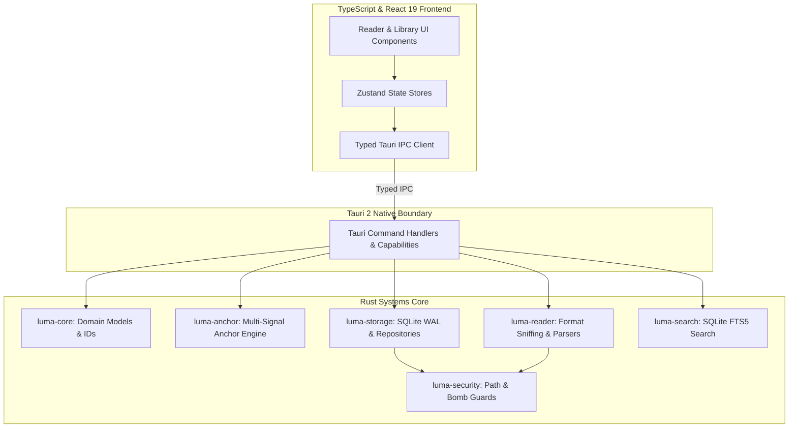

# Luma — Architectural Principles

## 1. Core Philosophy

Luma is a next-generation cross-platform digital reading and knowledge platform. It is engineered from the ground up to embody five non-negotiable principles:

1. **Local-First & Data Ownership**:
   - Zero compulsory cloud dependency. All books, annotations, bookmarks, reading history, and full-text indexes reside locally in an embedded SQLite database on the user's filesystem.
2. **Annotation Integrity (P0 Differentiator)**:
   - Highlights and notes must never drift, break, or attach to the wrong text when font family, font size, line spacing, margins, or window dimensions change.
3. **Logical vs Physical Separation (`Book` != `BookFile`)**:
   - `Book` represents the logical publication; `BookFile` represents the physical document on disk (`.epub`, `.pdf`, `.cbz`, `.txt`, `.md`).
   - Logical reading history and annotations belong to the `Book`, allowing multiple format instances without data duplication or loss.
4. **Security & Sandboxing**:
   - All imported digital documents are treated as untrusted input. Path traversal, decompression bombs, and executable scripts are eliminated at native and rendering boundaries.
5. **Clean Layering & Separation of Concerns**:
   - Systems logic in Rust; Experience & Presentation in TypeScript / React 19; Native platform boundary in Tauri 2; Portable core logic in WASM.

---

## 2. Layering & System Boundary Model

