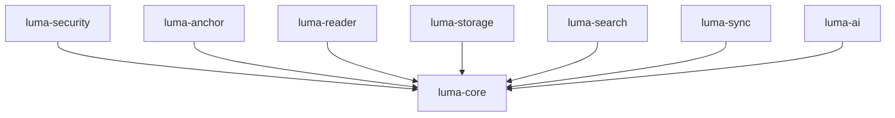

# Luma — Core Architecture

## 1. Modular Rust Workspace Design

The core of Luma is partitioned into 8 decoupled, single-responsibility Rust crates under `crates/`.

```text
crates/
├── luma-core/        # Pure domain entities, strongly-typed IDs, versions, and domain errors
├── luma-anchor/      # Resilient multi-signal fuzzy matching & anchor resolution engine
├── luma-reader/      # Document reader contracts, TOC, and format capability abstractions
├── luma-storage/     # SQLite persistence layer, migrations, connection manager, and repositories
├── luma-search/      # Search contracts, query parser, and FTS5 engine
├── luma-sync/        # Synchronizable entity models, change records, and vector clocks
├── luma-ai/          # Provider contracts (pure boundary, no premature production AI)
└── luma-security/    # Path validation, SHA-256 hashing, archive bomb limits, HTML sanitization
```

---

## 2. Dependency Direction & Hierarchy



- **Invariants**:
  - `luma-core` has zero dependencies on any sibling crate.
  - No circular dependencies exist between any crates.
  - Crates communicate across well-defined traits and data transfer objects.

---

## 3. Strongly-Typed Identifiers

To prevent entity ID mixing errors (e.g. passing a `BookId` where an `AnnotationId` is expected), Luma uses newtype wrappers around time-ordered UUIDs (UUID v7):

```rust
pub struct BookId(pub Uuid);
pub struct AnnotationId(pub Uuid);
pub struct FileId(pub Uuid);
pub struct AuthorId(pub Uuid);
pub struct DeviceId(pub Uuid);
```

Each ID parses and displays with a distinct human-readable prefix:
- `book_01j7b5w8e8z4t1a0b3c4d5e6f7`
- `ann_01j7b5w8e8z4t1a0b3c4d5e6f8`
- `dev_01j7b5w8e8z4t1a0b3c4d5e6f9`

---

## 4. Error Hierarchy

All domain and infrastructure failures map to typed variants of `LumaError` in `luma-core::error`:
- `InvalidId(String)`
- `DocumentError(String)`
- `UnsupportedFormat(String)`
- `CorruptedDocument(String)`
- `AnchorResolutionFailed(String)`
- `AmbiguousAnchor { score, threshold }`
- `StorageError(String)`
- `NotFound { entity_type, id }`
- `ValidationError(String)`
- `SecurityError(String)`
- `SyncConflict(String)`
- `Internal(String)`

No arbitrary raw panics or unwrapped errors are permitted across crate boundaries.
