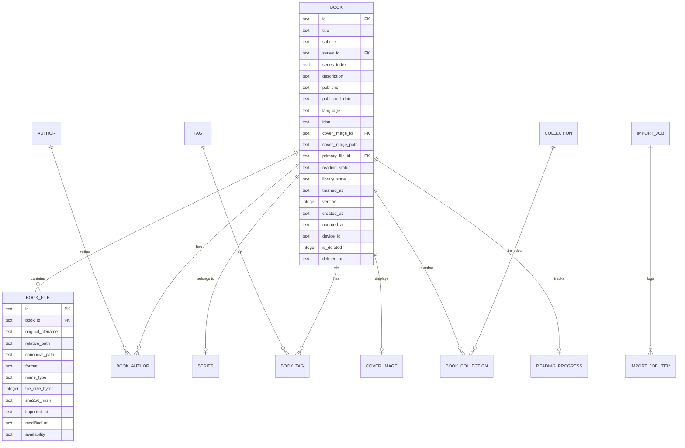

# Luma — Library Data Model Specification

## 1. Entity-Relationship Diagram

---

## 2. Core Entities

### 2.1 Book (Logical Publication)
- Represents the conceptual work (e.g. *The Rust Programming Language*).
- Holds title, subtitle, author IDs, series, series index, description, publisher, publication date, language, ISBN, reading status (`unread`, `reading`, `completed`, `archived`), library state (`active`, `archived`, `trashed`), and sync metadata.

### 2.2 BookFile (Physical Document)
- Represents a concrete file on disk (`.epub`, `.pdf`, `.cbz`, `.txt`, `.md`).
- Holds original filename, relative path, canonical absolute path, detected format, MIME type, file size in bytes, SHA-256 hash, import timestamp, last modified timestamp, and availability state (`available`, `missing`, `changed`, `invalid`).

### 2.3 Author & Series
- `Author`: Normalized author entity supporting multi-author relationships with explicit display ordering (`book_authors.position`).
- `Series`: Named series container supporting fractional and non-numeric positions (e.g. `1.5`, `A`, `Special`).

### 2.4 Tags vs Collections
- **Tags**: Descriptive labels that characterize the content of the book (e.g. `#rust`, `#systems`, `#distributed`).
- **Collections**: User-defined organizational folders for structuring their library (e.g. `To Read 2026`, `Computer Science Core`).
