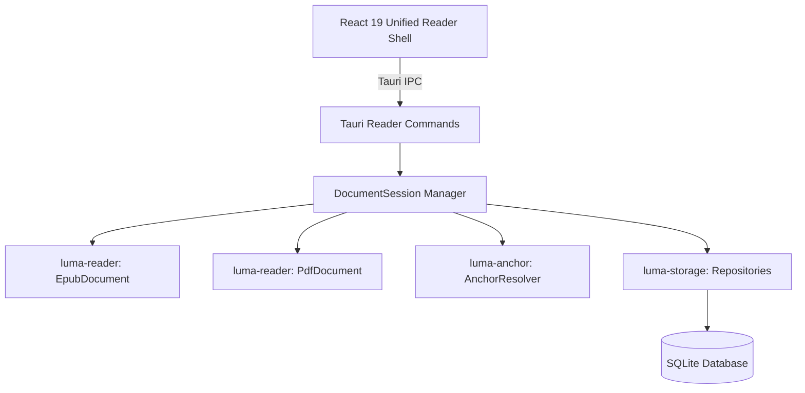

# Luma — Reader Subsystem Architecture

## 1. Overview & Principles

The Luma Reader subsystem provides the core reading engine for EPUB 2/3 and PDF documents.

### Architectural Rules:
1. **Separation of Concerns**:
   - **Library Subsystem**: Owns `Book`, `BookFile`, metadata, tags, and collections.
   - **Reader Engine**: Owns document parsing, spine representation, page extraction, navigation, and reading presentation.
   - **Annotation Subsystem (`luma-anchor`)**: Owns multi-signal anchor generation, fuzzy resolution, and confidence scoring.
   - **UI Layer**: Interacts exclusively through unified contracts (`DocumentReader`, `ReaderDocumentState`, `ReaderSettings`).
2. **Non-Destructive Presentation**:
   - Typography, font size, line spacing, margins, and themes are applied as live presentation layers without mutating the underlying document files.
3. **Multi-Signal Anchor Resilience**:
   - Text highlights bind to 4 signals: format locator (EPUB CFI / PDF Rects), exact quote string, NFKD normalized text, and 40-character prefix/suffix context.

---

## 2. Component Diagram

