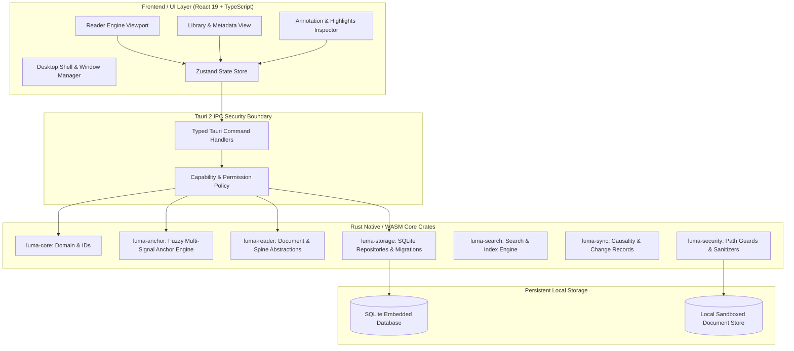

# Luma — System Architecture

## 1. High-Level Architecture Overview

Luma employs a layered, local-first desktop architecture combining high-performance native Rust core engines with a modern, responsive React/TypeScript UI connected via Tauri v2's capability-secured IPC.

---

## 2. Layer Responsibilities

### 2.1 UI Layer (`apps/desktop/src`, `packages/*`)
- **Rendering**: DOM-based EPUB reflow viewport, canvas-based high-DPI PDF renderer.
- **Selection Handling**: Intercepts user text selection and extracts surrounding text contexts (prefix/suffix).
- **State**: Ephemeral viewport state, active typography settings, and UI modals via Zustand.

### 2.2 IPC & Security Boundary (`src-tauri`)
- Minimalist command gateway.
- Capability-based security: No arbitrary filesystem read/write or raw shell execution allowed from the frontend.
- Deserialization and validation of all payloads before touching core business logic.

### 2.3 Rust Core Workspace (`crates/*`)
- **Zero UI Assumptions**: All domain logic, anchor calculations, schema queries, and document parsing are pure Rust.
- **Dual Compilation**: `luma-core` and `luma-anchor` are decoupled from OS-specific APIs and can compile to `wasm32-unknown-unknown` for web workers or browser contexts.
- **Persistence**: Managed via `rusqlite` with Write-Ahead Logging (WAL) and migrations.

---

## 3. Data Flow

1. **Document Ingestion**: User imports a file $\rightarrow$ `luma-security` validates path and runs archive bomb check $\rightarrow$ SHA-256 hash computed $\rightarrow$ `luma-reader` extracts metadata $\rightarrow$ `luma-storage` persists `Book` and `BookFile` in SQLite.
2. **Annotation Creation**: User highlights text in Reader $\rightarrow$ UI extracts quote, prefix, suffix, and CFI/PDF rect $\rightarrow$ IPC sends `save_annotation` $\rightarrow$ `luma-storage` records annotation $\rightarrow$ `luma-sync` logs `ChangeRecord`.
3. **Anchor Resolution**: When reading with modified font size/line spacing or document revision $\rightarrow$ `luma-anchor` evaluates candidates across normalized text $\rightarrow$ calculates confidence score $\rightarrow$ returns verified highlight coordinates or flags ambiguity.
