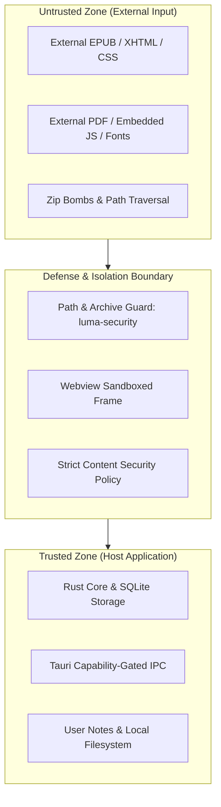

# Luma — Security Threat Model

## 1. Overview & Trust Boundaries

Luma parses, renders, and stores untrusted third-party document files (EPUB, PDF) obtained from public or untrusted sources. Security architecture must isolate untrusted document content from trusted host application state.

---

## 2. Threat Vectors & Mitigations

### 2.1 Malicious EPUB Archives (Zip Bombs & Path Traversal)
- **Threat**: Maliciously crafted zip entries attempting directory traversal (e.g. `../../etc/passwd` or `..\Windows\System32`) or decompression bombs expanding to hundreds of gigabytes.
- **Mitigation**:
  - `luma-security::sanitize_relative_path` rejects any entry containing `..`, absolute roots, or platform drive prefixes.
  - `luma-security::verify_archive_safety` enforces maximum entry limits (100,000 entries), max component size (500MB), and compression ratio limits (max 100:1).

### 2.2 Script Injection & XSS via EPUB XHTML
- **Threat**: Embedded `<script>` tags, inline `onload` handlers, or malicious `<iframe>` elements in EPUB content attempting to execute arbitrary code.
- **Mitigation**:
  - EPUB content is rendered inside an isolated iframe or webview with restricted permissions (`sandbox="allow-same-origin"` without `allow-scripts` or with tightly scoped scripts).
  - Strict Content Security Policy (CSP) blocking external network requests (`default-src 'self'`).
  - Document metadata fields (title, author, descriptions) are sanitized via `sanitize_untrusted_html`.

### 2.3 Malicious PDF Exploits
- **Threat**: Embedded PDF JavaScript (`/JS`, `/JavaScript`), malicious font parser exploits, or buffer overflows.
- **Mitigation**:
  - Disable PDF JavaScript execution in the reader engine.
  - Safe sandboxed rendering layer (e.g. PDF.js canvas or sandboxed Rust/WASM pdfium wrapper).

### 2.4 IPC Abuse
- **Threat**: Compromised webview attempting to call privileged system commands via Tauri IPC.
- **Mitigation**:
  - Tauri 2 capability configuration explicitly lists allowed commands (`list_books`, `save_annotation`, etc.).
  - No broad shell execution or raw disk write APIs are exposed over IPC.

### 2.5 Future AI Prompt Injection
- **Threat**: Malicious document containing prompt injection instructions intended to hijack summarization or agent workflows.
- **Mitigation**:
  - Strict boundary isolation between document text and AI system prompts.
  - Document text is treated strictly as unformatted user data passed in delimited quotes.
