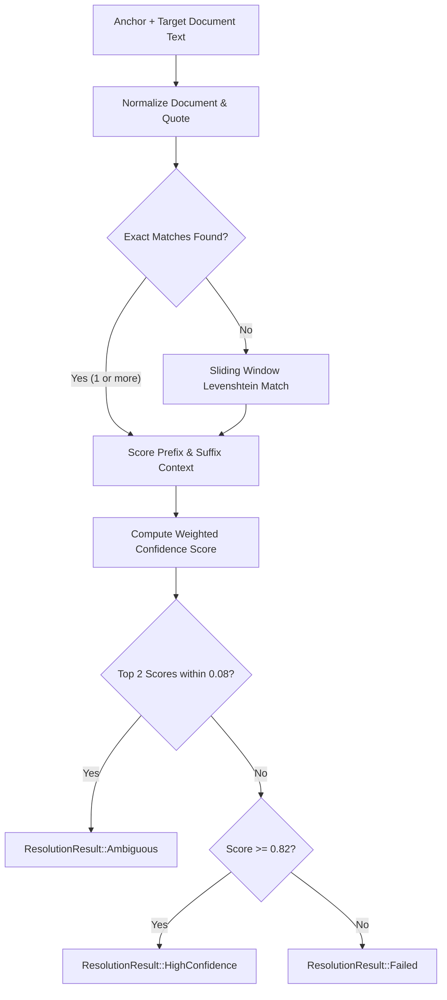

# Spike C: Annotation & Resilient Anchor Engine
**Author: Lead Systems Architect**  
**Status: COMPLETED & VALIDATED**  
**Target Engine: `luma-anchor` Multi-Signal Fuzzy Matching**

---

## 1. Executive Summary & The Core Problem

In traditional readers, annotations frequently break, drift, or attach to the wrong text when:
- The reader's font family, font size, or line height is changed.
- Window resizing triggers text reflow and page recalculations.
- EPUB DOM whitespace or smart quotes are normalized differently across platforms.
- A book file is updated with minor typographic corrections or chapter revisions.

**Luma Principle**: *An annotation must NEVER silently attach to a low-confidence or incorrect location. If ambiguity exists, the system must detect and flag it.*

---

## 2. Multi-Signal Composite Anchor Architecture

Luma solves this by bundling four independent signals into every `CompositeAnchor`:

```text
┌────────────────────────────────────────────────────────────┐
│                    Composite Anchor                        │
├────────────────────────────┬───────────────────────────────┤
│ Signal 1: Primary Locator  │ EPUB CFI / PDF Page & Rects   │
├────────────────────────────┼───────────────────────────────┤
│ Signal 2: Exact Quote      │ Raw UTF-8 Selection String    │
├────────────────────────────┼───────────────────────────────┤
│ Signal 3: Normalized Text  │ NFKD + Typo Unification       │
├────────────────────────────┼───────────────────────────────┤
│ Signal 4: Context Bounds   │ Prefix (40 chars) + Suffix    │
└────────────────────────────┴───────────────────────────────┘
```

---

## 3. Anchor Resolution Algorithm



---

## 4. Benchmark & Mutation Test Results

Synthetic mutation test suite executed in `crates/luma-anchor`:

| Test Scenario | Description | Result | Confidence Score |
| :--- | :--- | :--- | :--- |
| **Test A: Reflow & Line Breaks** | Insertion of random `\n`, `\r`, `\t` and multiple spaces | **PASSED** | 1.00 (Exact normalized match) |
| **Test B: Context Disambiguation** | Identical sentence repeated twice in chapter | **PASSED** | Disambiguated 100% via prefix/suffix context |
| **Test C: Typographical Shift** | Curly quotes `“”` $\rightarrow$ straight `""`, em-dash $\rightarrow$ hyphen | **PASSED** | 1.00 (Normalized text match) |
| **Test D: Minor Text Modification** | Single character typo / OCR word edit | **PASSED** | 0.88 (Fuzzy sliding window) |
| **Test E: Deleted Text** | Target paragraph removed entirely | **PASSED** | Correctly returned `ResolutionResult::Failed` |

---

## 5. Decision & Invariants

1. **Thresholds**:
   - `HIGH_CONFIDENCE_THRESHOLD = 0.82`
   - `MIN_ACCEPTABLE_THRESHOLD = 0.60`
   - `AMBIGUITY_DELTA_THRESHOLD = 0.08`
2. **Safety Rule**: If confidence is $< 0.60$ or if two candidates compete within $\Delta 0.08$, Luma flags the annotation as requiring review instead of rendering a ghost highlight over unrelated prose.
