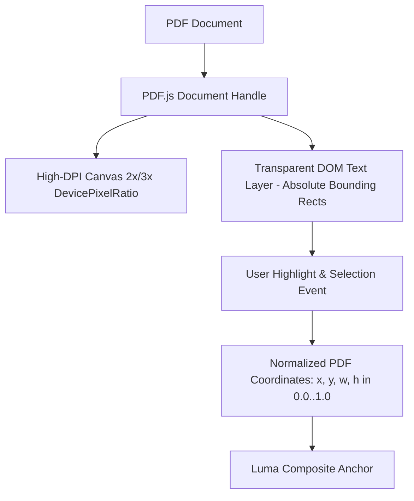

# Spike B: PDF Engine Investigation & Strategy
**Author: Lead Systems Architect**  
**Status: COMPLETED**  
**Target Engine: PDF.js (Canvas + TextLayer) with Native Rust Indexing**

---

## 1. Executive Summary & Objective

The goal of this spike is to evaluate rendering engines, high-DPI canvas performance, text selection coordinate layers, search indexing, OCR strategy, and licensing constraints for **PDF documents** in Luma.

---

## 2. Options Evaluated

### Option 1: PDF.js (Mozilla)
- **Architecture**: Web standards-based PDF renderer operating inside the Webview with an HTML5 `<canvas>` render layer and an overlying transparent DOM text selection layer.
- **Pros**:
  - Apache 2.0 License (completely clean for commercial & open-source distribution).
  - First-class text layer: High-precision text selection bounding boxes (x, y, width, height) mapped seamlessly to screen DPI.
  - Native integration with React/TypeScript frontend without C++ FFI or native library bundling issues across OSs.
  - Highly active maintenance and continuous security hardening by Mozilla.
- **Cons**: High-DPI rasterization of complex vector graphics requires careful canvas zoom management and viewport virtualization.

### Option 2: MuPDF (Artifex)
- **Architecture**: C library compiled to native binaries or WASM.
- **Pros**: Extreme rendering performance and crisp typography.
- **Cons**: **Strict AGPLv3 License** (or expensive commercial license). Incompatible with permissive MIT distribution of Luma.

### Option 3: PDFium (Google / Chromium)
- **Architecture**: C++ engine compiled via Rust FFI bindings (`pdfium-render`).
- **Pros**: Fast rendering, 3-clause BSD license.
- **Cons**: Heavy binary distribution requirement (~15MB per platform binary), cross-compilation friction, FFI memory safety overhead.

---

## 3. High-DPI Rendering & Coordinate Systems

### Coordinate Normalization Formula:
$$\hat{x} = \frac{x_{\text{pt}}}{W_{\text{page}}}, \quad \hat{y} = \frac{y_{\text{pt}}}{H_{\text{page}}}, \quad \hat{w} = \frac{w_{\text{pt}}}{W_{\text{page}}}, \quad \hat{h} = \frac{h_{\text{pt}}}{H_{\text{page}}}$$

---

## 4. Final Recommendation

1. **Viewer Layer**: Adopt **PDF.js** with virtualized page rendering and transparent text layers.
2. **Annotation Layer**: Store normalized geometry rects combined with exact text quotes and context prefix/suffixes.
3. **Licensing**: Fully compliant with Apache 2.0 / MIT.
